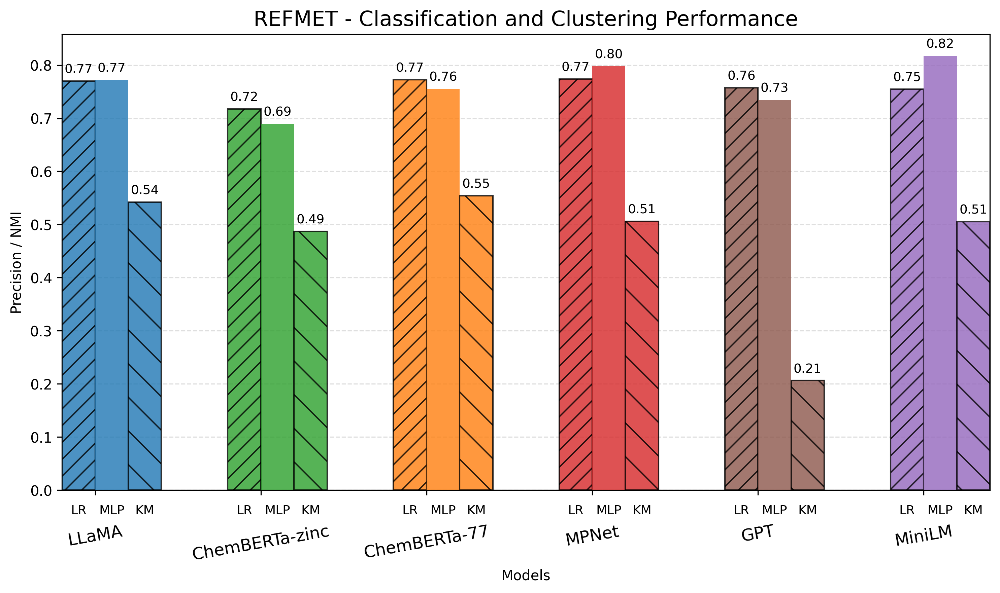
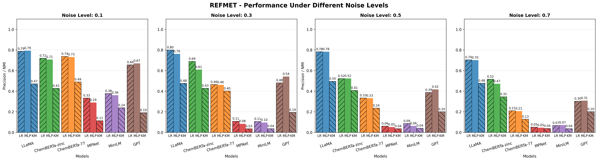
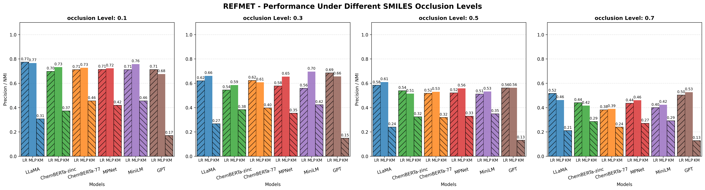

# MetaboLM

**Comparing General and Domain-Specific Pre-trained Language Models for Robust Natural Product Classification**  
_Accompanying code for the paper: "Comparing General and Domain-Specific Pre-trained Language Models for Robust Natural Product Classification"_

---

## Overview

MetaboLM provides a unified framework to benchmark and analyze the robustness of molecular embeddings generated by both general-purpose and chemistry-specific pre-trained language models. The codebase supports hierarchical and taxonomic classification of natural products, with a focus on evaluating model performance under realistic perturbations such as SMILES occlusion and embedding noise.

This repository accompanies the paper:

> **Comparing General and Domain-Specific Pre-trained Language Models for Robust Natural Product Classification**  
> _[Author list]_  
> [Conference/Journal, Year]

## Features

- **Benchmarking** of six popular language models (including LLaMA, ChemBERTa, GPT-2, MPNet, MiniLM) on two curated datasets: REFMET and NPClassifier.
- **Hierarchical classification** at multiple annotation levels (superclass, pathway, class).
- **Robustness analysis** under SMILES occlusion and embedding noise.
- **Unified evaluation pipeline** for clustering and supervised classification (KMeans, Logistic Regression, MLP).
- **Reproducible experiments** with scripts for data preprocessing, embedding extraction, and result visualization.

## Results

## Accuracy by Model and Classifier

<table>
  <tr>
    <td align="center">
      <br>
      <b>NPClassifier Superclass</b>
    </td>
    <td align="center">
      <br>
      <b>NPClassifier Pathway</b>
    </td>
  </tr>
  <tr>
    <td align="center">
      <br>
      <b>NPClassifier Class</b>
    </td>
    <td align="center">
      <br>
      <b>REFMET</b>
    </td>
  </tr>
</table>

*Accuracy of each model and classifier across all datasets and NPClassifier hierarchies. LLaMA and ChemBERTa consistently achieve the highest accuracy, with MLP classifiers providing a slight edge over logistic regression.*

## Robustness to Noise

<table>
  <tr>
    <td align="center">
      <br>
      <b>NPClassifier Superclass</b>
    </td>
    <td align="center">
      <br>
      <b>NPClassifier Pathway</b>
    </td>
  </tr>
  <tr>
    <td align="center">
      <br>
      <b>NPClassifier Class</b>
    </td>
    <td align="center">
      <br>
      <b>REFMET</b>
    </td>
  </tr>
</table>

*Performance of each model under increasing levels of Gaussian noise added to the embeddings. LLaMA and ChemBERTa show the highest robustness across all tasks.*

## Robustness to SMILES Occlusion

<table>
  <tr>
    <td align="center">
      <br>
      <b>NPClassifier Superclass</b>
    </td>
    <td align="center">
      <br>
      <b>NPClassifier Pathway</b>
    </td>
  </tr>
  <tr>
    <td align="center">
      <br>
      <b>NPClassifier Class</b>
    </td>
    <td align="center">
      <br>
      <b>REFMET</b>
    </td>
  </tr>
</table>

*Performance of each model under increasing levels of SMILES occlusion. LLaMA and ChemBERTa maintain superior performance, especially at higher levels of occlusion.*
## Getting Started

### Prerequisites

- Python 3.8+
- [PyTorch](https://pytorch.org/)
- [Transformers](https://huggingface.co/transformers/)
- [scikit-learn](https://scikit-learn.org/)
- [pandas](https://pandas.pydata.org/)
- [matplotlib](https://matplotlib.org/)
- [numpy](https://numpy.org/)
- ...

Install dependencies with:

```bash
bash condaenv.sh
